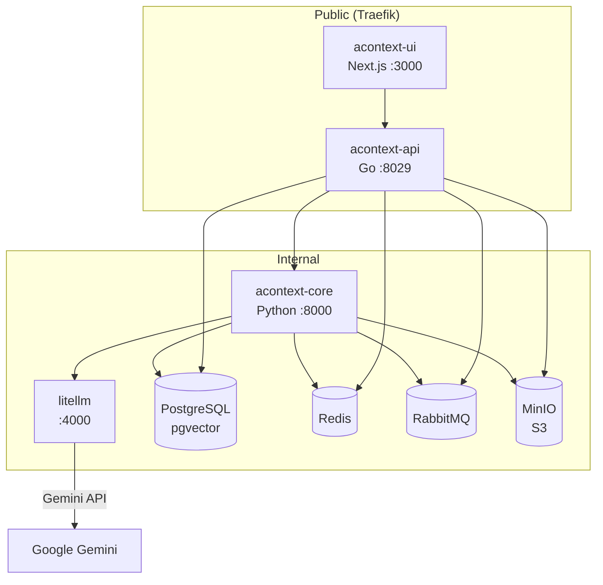

# AContext - Context Data Platform

Deployed on arise-server as a DokPloy compose service. Provides persistent context storage for AI agents across sessions and devices.

## URLs

| Service | URL | Purpose |
|---------|-----|---------|
| API | https://acontext-api.40hero.com | REST API (Go, port 8029) |
| Dashboard | https://acontext.40hero.com | Web UI (Next.js, port 3000) |
| API Docs | https://acontext-api.40hero.com/swagger/index.html | Swagger UI |
| Health | https://acontext-api.40hero.com/health | Health check endpoint |

## Architecture



## Authentication

API uses Bearer token auth with `sk-ac-` prefix:

```
Authorization: Bearer sk-ac-<ROOT_API_BEARER_TOKEN>
```

The `ROOT_API_BEARER_TOKEN` is set in DokPloy environment variables.

## Core Features

### Sessions
Persistent conversation threads with message storage and token counting.

```bash
# List sessions
curl -H "Authorization: Bearer sk-ac-TOKEN" \
  https://acontext-api.40hero.com/api/v1/session

# Create session
curl -X POST -H "Authorization: Bearer sk-ac-TOKEN" \
  -H "Content-Type: application/json" \
  -d '{}' \
  https://acontext-api.40hero.com/api/v1/session

# Store message (openai format)
curl -X POST -H "Authorization: Bearer sk-ac-TOKEN" \
  -H "Content-Type: application/json" \
  -d '{"format":"openai","blob":{"role":"user","content":"Hello"}}' \
  https://acontext-api.40hero.com/api/v1/session/{id}/messages
```

### Disk (Virtual Filesystem)
S3-backed file storage with glob and grep search.

```bash
# Upload file (multipart)
curl -X POST -H "Authorization: Bearer sk-ac-TOKEN" \
  -F "file_path=/notes/today.md" \
  -F "file=@local-file.md" \
  https://acontext-api.40hero.com/api/v1/disk/{disk_id}/artifact

# Read file
curl -H "Authorization: Bearer sk-ac-TOKEN" \
  "https://acontext-api.40hero.com/api/v1/disk/{disk_id}/artifact?file_path=/notes/today.md&with_content=true"

# List directory
curl -H "Authorization: Bearer sk-ac-TOKEN" \
  "https://acontext-api.40hero.com/api/v1/disk/{disk_id}/artifact/ls?path=/"
```

### Agent Skills
Reusable learned patterns and procedures.

## Deployment Details

| Field | Value |
|-------|-------|
| Compose file | `compose/acontext.yaml` |
| DokPloy compose ID | `DBezrZjirLrWVDnb50t0z` |
| DokPloy app name | `compose-calculate-back-end-circuit-kpo5o3` |
| Domain zone | `40hero.com` (Cloudflare) |
| Network | `dokploy-network` (external) + `internal` |

### Services (10 containers)

| Service | Image | Network | Notes |
|---------|-------|---------|-------|
| acontext-api | `ghcr.io/memodb-io/acontext-api:latest` | dokploy + internal | Go REST API |
| acontext-core | `ghcr.io/memodb-io/acontext-core:latest` | internal | Python processing |
| acontext-ui | `ghcr.io/memodb-io/acontext-ui:latest` | dokploy + internal | Next.js dashboard |
| litellm | `ghcr.io/berriai/litellm:main-latest` | internal | LLM proxy to Gemini |
| postgres | `pgvector/pgvector:pg17` | internal | Database with vector extension |
| redis | `redis:7-alpine` | internal | Cache |
| rabbitmq | `rabbitmq:3-management-alpine` | internal | Message queue |
| minio | `minio/minio:latest` | internal | S3-compatible storage |
| postgres-init | `pgvector/pgvector:pg17` | internal | One-shot: creates pgvector extension |
| minio-init | `minio/mc:latest` | internal | One-shot: creates S3 bucket |

### LiteLLM Configuration

Routes OpenAI-compatible API calls to Google Gemini:

| Model alias | Actual model |
|-------------|-------------|
| `gpt-4.1` | `gemini/gemini-2.5-flash` |
| `text-embedding-3-small` | `gemini/text-embedding-004` |

Master key: `sk-litellm-acontext` (internal only, not exposed publicly).

### Environment Variables (DokPloy)

```
POSTGRES_USER=acontext
POSTGRES_PASSWORD=<generated>
POSTGRES_DB=acontext
REDIS_PASSWORD=<generated>
RABBITMQ_USER=acontext
RABBITMQ_PASSWORD=<generated>
MINIO_ROOT_USER=acontext
MINIO_ROOT_PASSWORD=<generated>
ROOT_API_BEARER_TOKEN=<generated>
GEMINI_API_KEY=<google api key>
S3_BUCKET=acontext-assets
```

## Claude Code Plugin

The `acontext` cc-plugin provides MCP tools for Claude Code at `/home/trent/workspace/cc-plugins/acontext/`.

Install: `/plugin install /home/trent/workspace/cc-plugins/acontext`

Credentials in `~/.config/cc-plugins/.env`:
```
ACONTEXT_BASE_URL=https://acontext-api.40hero.com
ACONTEXT_API_KEY=sk-ac-<ROOT_API_BEARER_TOKEN>
ACONTEXT_DISK_ID=<default disk UUID>
```

### MCP Tools (22)

| Category | Tools |
|----------|-------|
| Sessions | `session_list`, `session_create`, `session_delete`, `session_store_message`, `session_get_messages`, `session_get_token_counts`, `session_flush`, `session_get_configs`, `session_update_configs` |
| Disk | `disk_list`, `disk_create`, `disk_write`, `disk_read`, `disk_ls`, `disk_delete`, `disk_glob`, `disk_grep` |
| Skills | `skill_list`, `skill_get`, `skill_create`, `skill_delete` |
| Health | `health_check` |

## Troubleshooting

### Known issue: AContext config.go env var handling

The Go API uses Viper with a config.yaml template. If any env var referenced as `${VAR}` is undefined, the **entire key** containing it is removed from config, and Viper defaults kick in. This caused early deployment failures when `RABBITMQ_VHOST_ENCODED` was missing, causing the API to try connecting to `127.0.0.1:15672` (the hardcoded default).

**Always ensure these env vars are set** (even if they seem optional):
- `RABBITMQ_VHOST_ENCODED=%2F`
- `APP_ENV=release`
- `S3_ENDPOINT` and `S3_INTERNAL_ENDPOINT`

### LiteLLM health check

The LiteLLM Docker image (`ghcr.io/berriai/litellm:main-latest`) does not have `wget` or `curl` installed. Docker health checks using these tools will always fail. The compose uses `service_started` instead of `service_healthy` for the litellm dependency.

### Redeploying

After changing the compose file:
1. Update in DokPloy (or push via API)
2. Click Deploy (or `dokploy_api compose deploy <id>`)

If containers don't pick up changes (health check config, etc.), stop first then deploy:
```bash
dokploy_api compose stop <id>
# wait 10s
dokploy_api compose deploy <id>
```
