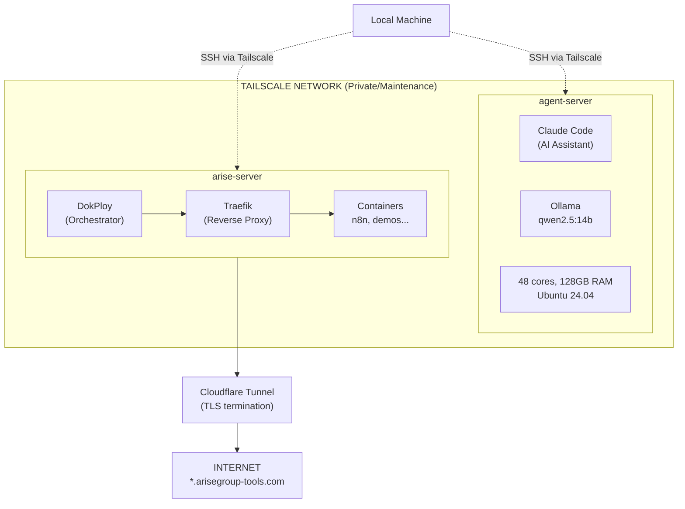
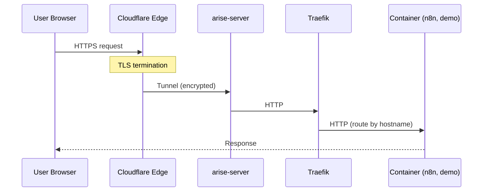
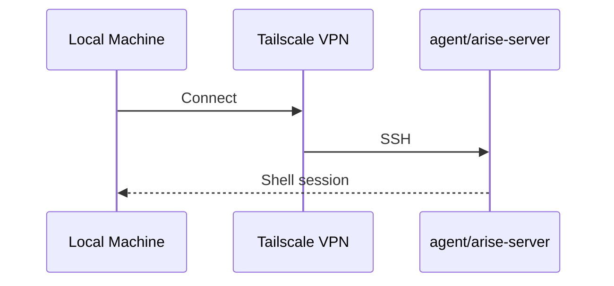

# Architecture Overview

## Network Topology

## Components

### Tailscale (Both Servers)
- **Purpose**: Private network for internal access
- **Use case**: SSH maintenance, inter-server communication
- **Hostnames**: `agent-server`, `arise-server`

### agent-server
| Component | Description |
|-----------|-------------|
| Claude Code | AI coding assistant (Anthropic OAuth) |
| Ollama | Local LLM server (qwen2.5:14b) |
| tmux | Session persistence for long-running agents |
| Docker | Container runtime for Ollama |

**Access**: Tailscale only (no public exposure)

### arise-server
| Component | Description |
|-----------|-------------|
| DokPloy | Container orchestration UI (port 3000) |
| Traefik | Reverse proxy, routes by hostname |
| Docker | Container runtime for all services |
| Cloudflare Tunnel | Public internet ingress |

**Access**: Tailscale (SSH) + Cloudflare (public web)

### Cloudflare
| Component | Description |
|-----------|-------------|
| DNS | Wildcard `*.arisegroup-tools.com` → tunnel |
| Tunnel | Secure connection from Cloudflare edge to server |
| TLS | Handles HTTPS termination (internal traffic is HTTP) |

## Traffic Flow

### Public Web Request

### SSH Access (Maintenance)

## Current Services

### arise-server
| Service | URL | Description |
|---------|-----|-------------|
| DokPloy | dokploy.arisegroup-tools.com | Container management UI |
| n8n (prod) | n8n.arisegroup-tools.com | Production workflow automation |
| tc-n8n | tc-n8n.arisegroup-tools.com | Trent's sandbox |
| ca-n8n | ca-n8n.arisegroup-tools.com | CA's sandbox |
| ma-n8n | ma-n8n.arisegroup-tools.com | MA's sandbox |
| mk-n8n | mk-n8n.arisegroup-tools.com | MK's sandbox |

### agent-server
| Service | Endpoint | Description |
|---------|----------|-------------|
| Ollama | localhost:11434 | Local LLM API |
| Claude Code | CLI (`claude`) | AI coding assistant |
